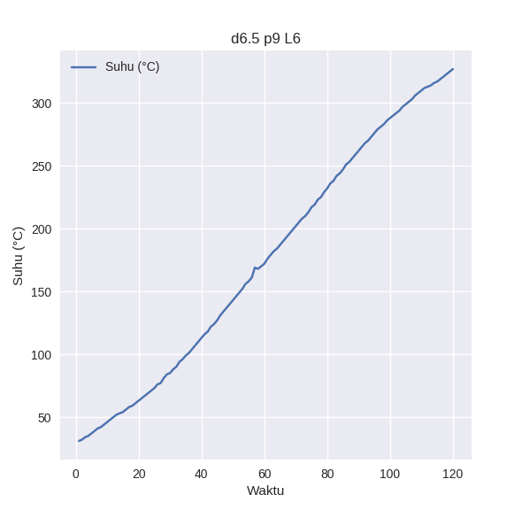

# plot file excel
hiya 

## usage
### fast plotting 
`python oneliner.py NAMA_FILE.xlsx  x y 'SHEET_NAME'`
NAMA_FILE: filename of the excel file   
SHEET_NAME, x, y: self-explanatory   
ex: python oneliner.py data.xlsx 'Waktu' 'Suhu (°C)' 'd6.5 p9 L6'   

 
 
 ### multi line plot
 follow instructions on `python many.py`

## CL 
   
   
   
   

## D5
   
   
   
   

## D65
   
   
   
   
